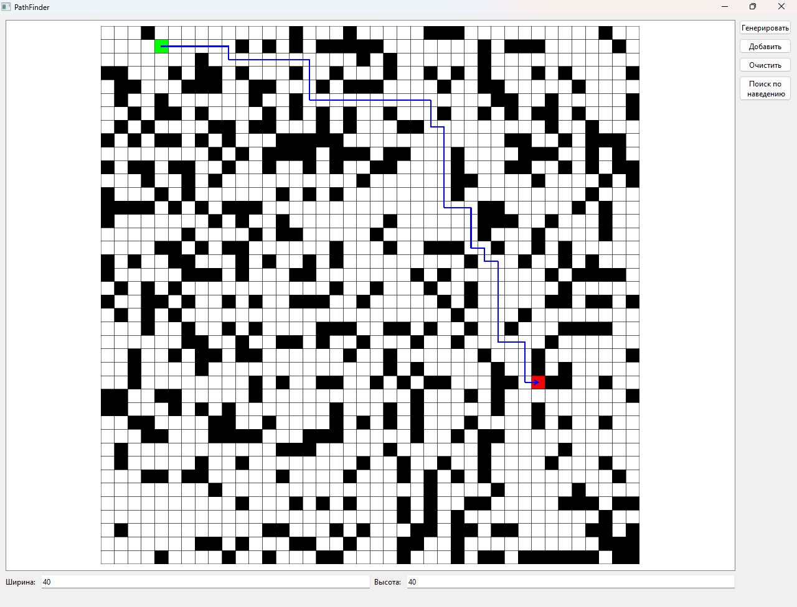

# PathFinder
Визуальная репрезентация алгоритма поиска в ширину с заполнением поля случаными препятствиями.\n
Поиск происходит от зеленого квдарату к красному.
Левый щелчок - поставить зеленый квадрат, правый - красный.
## Функционал

1. Генерировать: заполняет поле случайными препятствиями.
2. Добавить: левая кнопка мыши добавляет препятствие, правая - удаляет.
3. Очистить - убирает все препятсвтия с поля.
4. Поиск по наведению: красный квадрат двигается вместе с курсором, зеленый квадрат меняет положение по левому щелчку мыши.